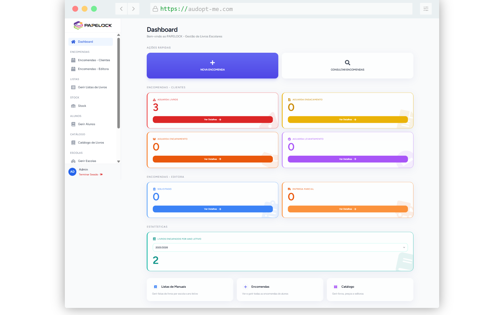
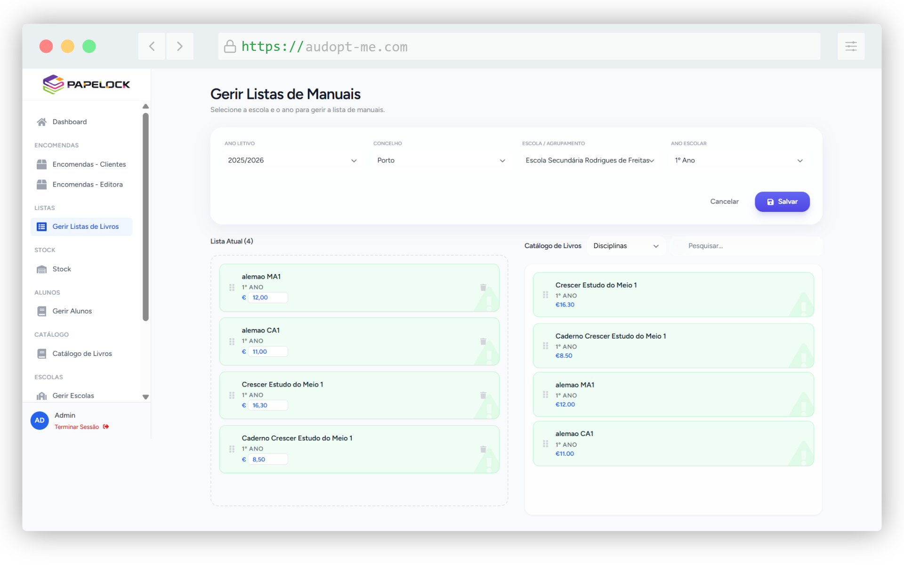
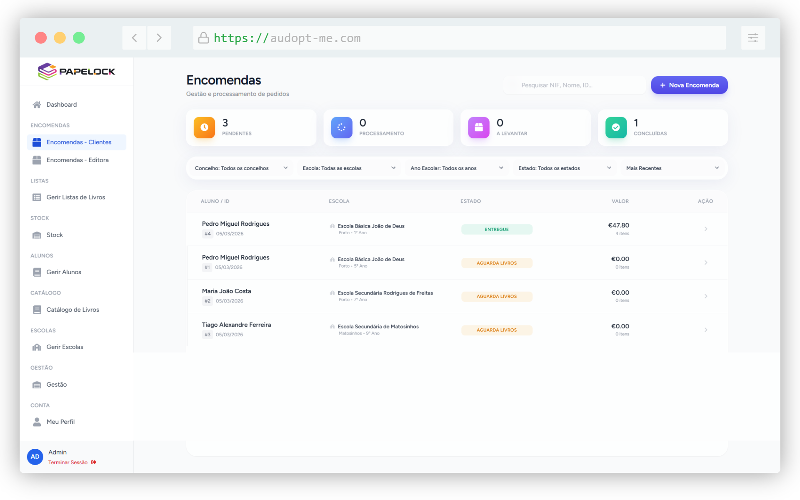
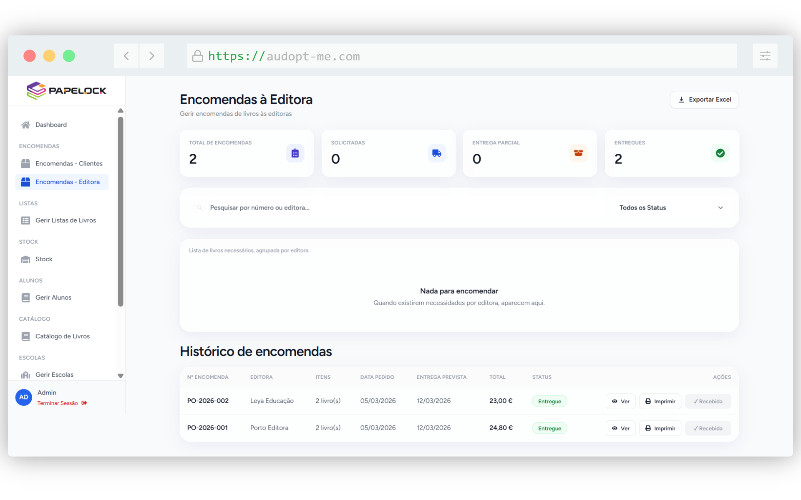
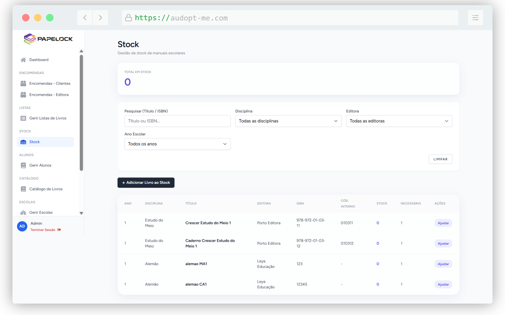

# 📚 Plataforma de Gestão de Manuais Escolares e Encomendas

> Plataforma web para **gestão de manuais escolares e respetivas encomendas**, desenvolvida em **Laravel**, com foco em organização, escalabilidade e boas práticas de desenvolvimento em equipa.

---

## 🎯 Objetivo do Projeto

Criar uma plataforma que permita:

- Gestão de manuais escolares
- Gestão de encomendas associadas aos manuais
- Organização por entidades (ex: escolas, clientes, fornecedores)
- Fluxos claros de criação, edição e acompanhamento
- Base sólida para futuras extensões (relatórios, permissões, histórico, etc.)

---

## 🛠️ Tecnologias Utilizadas

- **Backend:** Laravel 11 (PHP 8.2+)
- **Frontend:** React.js
- **Base de Dados:** MySQL
- **Gestão:** Jira (Metodologia Ágil)

---

## 🖼️ Demonstração (Screenshots)

| Dashboard Administrativo | Gestão de Listas de Livros |
| :---: | :---: |
|  |  |

| Encomendas de Clientes | Encomendas para a Editora |
| :---: | :---: |
|  |  |

| Gestão de Stock Dinâmico |
| :---: |
|  |

---

## 👥 Autores

| [ <b>José Pinho</b>](https://github.com/josepinho22) | [ <b>João Dias</b>](https://github.com/joaodias23) | [ <b>Mayara Sampaio</b>](https://github.com/MayaraSampaio) | [ <b>Thais Lira</b>](https://github.com/thaisliira) |
| :---: | :---: | :---: | :---: |

